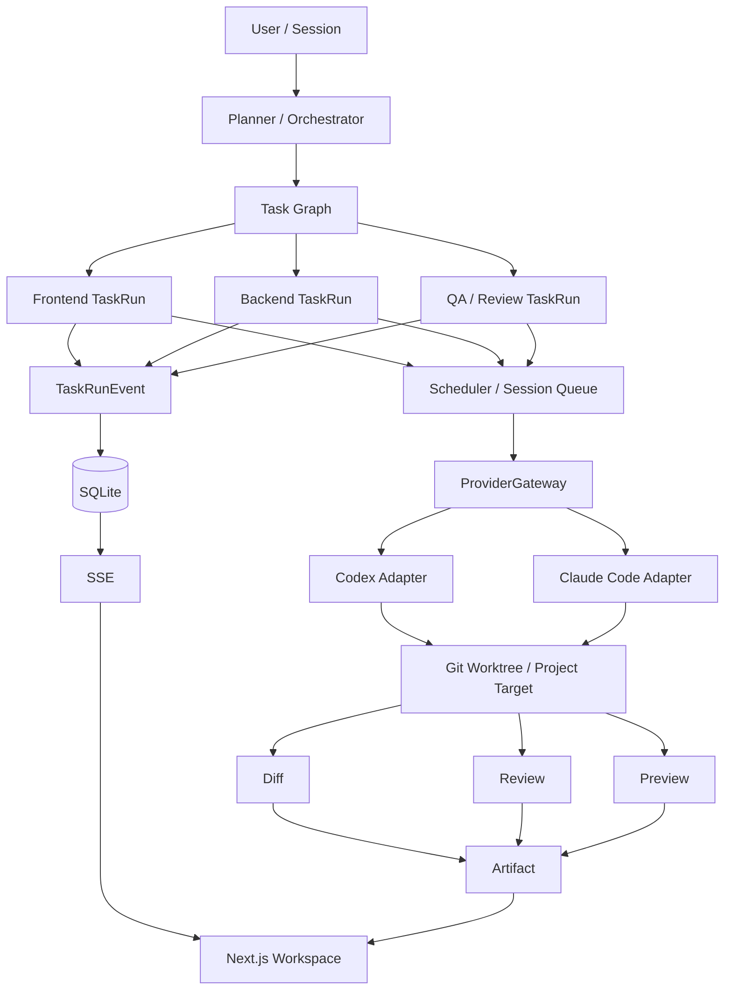

<div align="center">


# AgentHub

### IM-style Multi-Agent Coding Workspace

**让多 Agent 编程从“聊天回答”走向可调度、可隔离、可追踪、可验证的工程交付。**

<p>
  
  
  
  
  
  
</p>


[核心能力](#核心能力) · [系统架构](#系统架构) · [执行链路](#执行链路) · [技术栈](#技术栈) · [快速开始](#快速开始)

</div>

---

## 项目简介

AgentHub 是一个面向**本地开发工作流**的 Multi-Agent Coding Workspace。

用户只需要在 Session 中提出开发需求，系统会完成任务规划、角色路由、运行调度与代码执行，并将执行结果沉淀为 **Diff / Review / Preview / TaskRunEvent** 等工程证据。

> **核心目标：不是让多个 Agent 同时“聊天”，而是让多个 Agent 围绕真实代码任务协作，并且让每一步执行都有边界、有状态、有结果可查。**

```text
需求 → Planner / Orchestrator → Task Graph → Scheduler
    → ProviderGateway → Coding Agent → Git Worktree / Target
    → Diff / Review / Preview → TaskRunEvent → SSE → Web Workspace
```

---

## 核心能力

| 能力                          | AgentHub 的实现                                              |
| ----------------------------- | ------------------------------------------------------------ |
| **Multi-Agent Orchestration** | 将需求拆分为 frontend / backend / qa 等角色任务，通过 Task Graph 描述依赖与目标 |
| **Runtime Mapping**           | ProviderGateway 将角色与具体 Codex / Claude Code 运行时解耦，统一完成 Provider 解析与能力映射 |
| **Workspace Isolation**       | 每个 Session 使用独立 Git Worktree，避免不同会话直接写入同一个代码工作区 |
| **Concurrency Control**       | Session Queue + Scheduler + Target Lock 协同控制写任务顺序与目标级互斥 |
| **Realtime Trace**            | TaskRunEvent 持久化到 SQLite，并通过 SSE 增量推送前端        |
| **Evidence Delivery**         | 真实代码修改进一步形成 Diff、Review、Preview 和运行诊断，而不是只返回文本结果 |

---

## 系统架构



### 四层设计

| 层级          | 关键模块                                     | 主要职责                               |
| ------------- | -------------------------------------------- | -------------------------------------- |
| **Planning**  | Planner、Orchestrator、Task Graph            | 需求理解、角色路由、任务拆解与依赖组织 |
| **Execution** | TaskRun、Scheduler、ProviderGateway、Adapter | 运行调度、Provider 选择与 Agent 执行   |
| **Isolation** | Git Worktree、Target Scope、Target Lock      | 工作区隔离、代码边界与并发写保护       |
| **Evidence**  | Diff、Review、Preview、TaskRunEvent、SSE     | 结果验证、运行追踪与前端实时展示       |

---

## 执行链路

### 1. Planner：把自然语言需求变成任务图

用户发送需求后，Planner / Orchestrator 根据任务意图和角色能力生成多个 Task。

每个 Task 重点描述：

```text
role       → 谁执行，例如 frontend / backend / qa
target     → 允许作用在哪个代码目标
dependsOn  → 当前任务依赖哪些前置任务
intent     → 当前任务要完成什么工程目标
```

任务图在进入执行阶段前会经过结构校验，使后续 Scheduler 可以基于依赖关系推进任务。

### 2. Scheduler：决定任务什么时候执行

AgentHub 将任务状态、依赖、访问模式与目标锁共同纳入调度。

```text
TaskRun
   ↓
Dependency Check
   ↓
Session Queue
   ↓
Target Lock
   ↓
Adapter Execution
```

- 只读任务可以并发执行；
- 写任务进入 Session 写队列；
- 同一写目标通过 Target Lock 建立互斥边界；
- TaskRun 生命周期负责维护运行状态与锁释放。

### 3. ProviderGateway：决定任务交给哪个 Coding Runtime

角色 Agent 不直接依赖某个模型或 CLI。

ProviderGateway 在 TaskRun 与具体 Coding Provider 之间建立统一运行层，负责：

- 根据 role / target / capability 解析运行 Provider；
- Provider 健康检查；
- 容量与并发控制；
- Adapter 能力映射；
- 运行事件与 Provider 证据记录。

当前主要 Coding Adapter：

```text
CodexAdapter
ClaudeCodeAdapter
```

这样上层业务只依赖统一执行接口，不需要在 Planner 或 TaskRun 中耦合具体 CLI。

### 4. Worktree + Target Lock：控制多 Agent 写冲突

不同 Session 通过 Git Worktree 获得独立代码工作目录：

```text
Repository
├── main working tree
├── session-A worktree
├── session-B worktree
└── session-C worktree
```

Worktree 解决不同 Session 之间的工作区隔离；Session Queue 与 Target Lock 进一步处理同一目标上的并发写入。

### 5. TaskRunEvent + SSE：实时追踪执行过程

Coding Adapter 输出的运行事件会被标准化并持久化为 TaskRunEvent：

```text
Adapter Event
    ↓
TaskRunEvent
    ↓
SQLite
    ↓
SSE
    ↓
Web Workspace
```

前端通过 SSE 持续接收增量状态，可展示 Task、Provider、Queue、Artifact 与执行轨迹。

### 6. Artifact：把 Agent 输出变成可验证结果

AgentHub 不把“模型说完成了”视为最终交付。

| Artifact         | 作用                                                 |
| ---------------- | ---------------------------------------------------- |
| **Diff**         | 查看真实文件修改与代码变化                           |
| **Review**       | 对代码变更进行结构化审查                             |
| **Preview**      | 启动并展示本地 Web 预览                              |
| **TaskRunEvent** | 保存运行状态与执行轨迹                               |
| **Diagnostics**  | 将 Queue、Provider、Preview 等运行信息投影为可读状态 |

---

## 技术栈

| 模块          | 技术                                                    |
| ------------- | ------------------------------------------------------- |
| Web Workspace | Next.js App Router、TypeScript、Tailwind CSS、shadcn/ui |
| API           | FastAPI、Pydantic、SQLModel                             |
| Persistence   | SQLite                                                  |
| Realtime      | Server-Sent Events (SSE)                                |
| Agent Runtime | Codex CLI、Claude Code CLI、Adapter abstraction         |
| Isolation     | Git Worktree、Target Scope、Target Lock                 |
| Demo Frontend | Vite + React                                            |
| Specification | OpenSpec                                                |

---

## 核心目录

```text
AgentHub/
├── apps/
│   ├── api/                 # FastAPI 后端
│   │   └── app/
│   │       ├── planning.py
│   │       ├── run_engine.py
│   │       ├── provider_gateway.py
│   │       ├── session_queue.py
│   │       ├── scheduler.py
│   │       ├── target_locks.py
│   │       ├── codex_adapter.py
│   │       ├── claude_code_adapter.py
│   │       ├── diffs.py
│   │       └── previews.py
│   │
│   ├── web/                 # Next.js Workspace
│   ├── demo/                # Vite React 示例目标
│   └── demo-api/            # FastAPI 示例后端目标
│
├── openspec/                # Spec / change records
├── docs/                    # Architecture / project docs
└── scripts/                 # Development scripts
```

### 核心模块

| 文件                     | 职责                                                 |
| ------------------------ | ---------------------------------------------------- |
| `planning.py`            | Mention 解析、Planner / LLM Planner、Task Graph 生成 |
| `run_engine.py`          | TaskRun 主执行链路与运行生命周期                     |
| `provider_gateway.py`    | Provider 解析、健康、容量、运行时映射                |
| `session_queue.py`       | Session 内任务队列与读写调度                         |
| `scheduler.py`           | 任务依赖与可运行状态判断                             |
| `target_locks.py`        | Target 写锁管理                                      |
| `codex_adapter.py`       | Codex CLI 执行适配                                   |
| `claude_code_adapter.py` | Claude Code CLI 执行适配                             |
| `diffs.py`               | Git / 文件变更采集                                   |
| `previews.py`            | 本地 Preview 生命周期管理                            |

---

## 快速开始

### 环境要求

- Node.js ≥ 18
- pnpm ≥ 9
- Python ≥ 3.9
- Git

### 1. 安装依赖

```bash
pnpm install

python3 -m venv .venv
.venv/bin/pip install -r apps/api/requirements.txt

pnpm demo:setup
```

### 2. 初始化数据库

```bash
pnpm db:init
```

### 3. 启动服务

终端 1：

```bash
pnpm dev:api
```

终端 2：

```bash
pnpm dev:web
```

浏览器访问：

```text
http://127.0.0.1:3000
```

### 4. 发送任务

```text
@orchestrator build a login page for the demo app
```

系统会生成任务计划，并进入 TaskRun → Coding Agent → Diff / Review / Preview 的执行链路。

---

## 常用命令

```bash
pnpm dev:web       # 启动 Web Workspace
pnpm dev:api       # 启动 FastAPI
pnpm demo:dev      # 启动 Demo App
pnpm db:init       # 初始化 SQLite
pnpm check         # 代码检查
pnpm test          # 运行测试
```

---

<div align="center">


### AgentHub

**From AI conversation to verifiable engineering delivery.**

</div>
