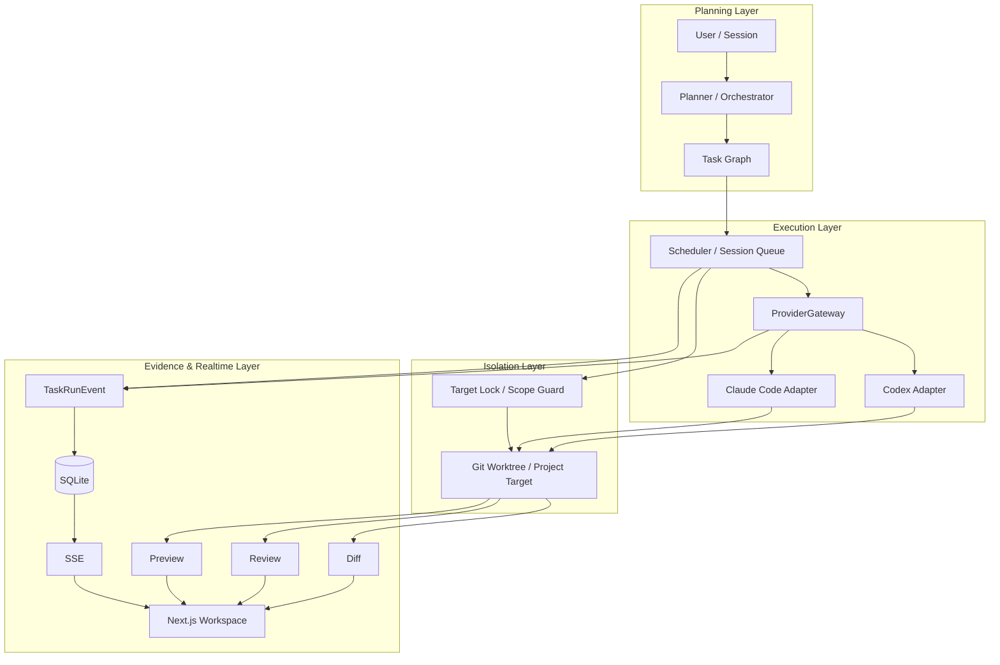

<div align="center">


# AgentHub

### IM-style Multi-Agent Coding Workspace

**让多 Agent 编程从“聊天回答”走向可调度、可隔离、可追踪、可验证的工程交付。**

<p>
  
  
  
  
  
  
</p>


[核心能力](#核心能力) · [系统架构](#系统架构) · [执行链路](#执行链路) · [技术栈](#技术栈) · [核心模块](#核心模块) · [快速开始](#快速开始) · [交付文档](#交付文档)

</div>

---

## 项目简介

AgentHub 是一个面向**本地开发工作流**的 Multi-Agent Coding Workspace。

用户在 Session 中提出开发需求后，系统完成需求理解、任务规划、角色路由、运行调度与代码执行，并将执行过程沉淀为 **TaskRun / TaskRunEvent / Diff / Review / Preview** 等可追踪工程结果。

> **核心目标：不是让多个 Agent 同时“聊天”，而是让多个 Agent 围绕真实代码任务协作，并让每一步执行都有边界、有状态、有结果可查。**

```text
User Request
    ↓
Planner / Orchestrator
    ↓
Task Graph
    ↓
Scheduler
    ↓
ProviderGateway
    ↓
Coding Agent
    ↓
Git Worktree / Project Target
    ↓
Diff / Review / Preview
    ↓
TaskRunEvent → SSE → Web Workspace
```

---

## 交付文档

| 文档 | 用途 |
|---|---|
| [`docs/demo-script.md`](docs/demo-script.md) | 录屏、现场演示和答辩脚本 |
| [`docs/architecture.md`](docs/architecture.md) | 架构、核心链路、模块地图和可靠性边界 |
| [`docs/project-state.md`](docs/project-state.md) | 当前基线、冻结证据、已知限制与交付状态 |
| [`AGENTS.md`](AGENTS.md) | AI 协作守则和项目 guardrails |
| [`openspec/changes`](openspec/changes) | Spec、任务拆解和演进记录 |
| [`docs/change-log.md`](docs/change-log.md) | 当前工程变更和验证记录 |
| [`docs/history/README.md`](docs/history/README.md) | 历史状态与旧变更记录索引 |

---

## 核心能力

| 能力                          | AgentHub 的实现                                              |
| ----------------------------- | ------------------------------------------------------------ |
| **Multi-Agent Orchestration** | 将需求拆分为 frontend / backend / qa 等角色任务，并通过 Task Graph 描述依赖关系与执行目标 |
| **Runtime Mapping**           | ProviderGateway 将角色与具体 Coding Provider 解耦，统一完成 Provider 解析、能力匹配与运行时选择 |
| **Workspace Isolation**       | 每个 Session 使用独立 Git Worktree，避免不同会话直接写入同一工作目录 |
| **Concurrency Control**       | Session Queue + Scheduler + Target Lock 协同控制写任务顺序与目标级互斥 |
| **Realtime Trace**            | TaskRunEvent 持久化到 SQLite，通过 SSE 增量推送，并以 Session 级游标支持断线恢复 |
| **Evidence Delivery**         | 将真实代码修改进一步组织为 Diff、Review、Preview 与运行诊断，而不是只返回文本结果 |

---

## 系统架构



### 四层设计

| 层级          | 关键模块                                     | 主要职责                               |
| ------------- | -------------------------------------------- | -------------------------------------- |
| **Planning**  | Planner、Orchestrator、Task Graph            | 需求理解、角色路由、任务拆解与依赖组织 |
| **Execution** | TaskRun、Scheduler、ProviderGateway、Adapter | 任务调度、Provider 选择与 Agent 执行   |
| **Isolation** | Git Worktree、Target Scope、Target Lock      | 工作区隔离、代码边界与并发写保护       |
| **Evidence**  | Diff、Review、Preview、TaskRunEvent、SSE     | 结果验证、执行追踪与前端实时展示       |

---

## 执行链路

### 1. Planning & Task Graph

Planner / Orchestrator 将自然语言需求转换为可执行任务，并为任务建立角色、目标与依赖关系。

```text
User Request
    ↓
Intent / Mention Parsing
    ↓
Planner / LLM Planner
    ↓
Task Graph Validation
    ↓
Executable Tasks
```

每个 Task 主要描述：

- `role`：由哪个角色执行，如 frontend / backend / qa；
- `target`：任务允许作用的代码目标；
- `dependsOn`：任务之间的依赖关系；
- `intent`：任务需要完成的工程目标。

---

### 2. Scheduling & Isolation

任务进入执行阶段后，Scheduler 根据依赖、访问模式和目标锁判断是否可运行。

```text
TaskRun
   ↓
Dependency Check
   ↓
Session Queue
   ↓
Target Lock
   ↓
Worktree / Target
```

核心策略：

- 只读任务可并发执行；
- 写任务进入 Session 写队列；
- 同一目标通过 Target Lock 建立互斥边界；
- Session 之间使用独立 Git Worktree 隔离工作目录。

---

### 3. Provider Runtime

上层任务不直接依赖具体模型或 CLI。

ProviderGateway 位于 TaskRun 与 Coding Runtime 之间，统一负责：

- 根据 role / target / capability 解析运行 Provider；
- Provider 健康检查；
- 容量与并发控制；
- Adapter 能力匹配；
- Provider 运行证据与事件记录。

当前主要 Coding Adapter：

```text
CodexAdapter
ClaudeCodeAdapter
```

因此 Planner、Task Graph 与 TaskRun 可以保持稳定，而底层 Coding Runtime 可以独立配置和扩展。

---

### 4. Evidence & Realtime Trace

AgentHub 不把“模型输出完成”直接视为最终交付，而是继续采集可验证的工程结果。

```text
Coding Agent
    ↓
File Changes
    ↓
Diff / Review / Preview
    ↓
TaskRunEvent
    ↓
SQLite
    ↓
SSE
    ↓
Web Workspace
```

| 结果             | 作用                                     |
| ---------------- | ---------------------------------------- |
| **Diff**         | 查看真实文件修改与代码变化               |
| **Review**       | 对代码变更形成结构化审查结果             |
| **Preview**      | 启动并展示本地 Web 预览                  |
| **TaskRunEvent** | 持久化任务执行状态与运行轨迹，并提供 Session 级 SSE 恢复游标 |
| **Diagnostics**  | 汇总 Queue、Provider、Preview 等运行状态 |

---

## 技术栈

| 模块              | 技术                                                    |
| ----------------- | ------------------------------------------------------- |
| **Web Workspace** | Next.js App Router、TypeScript、Tailwind CSS、shadcn/ui |
| **API**           | FastAPI、Pydantic、SQLModel                             |
| **Persistence**   | SQLite                                                  |
| **Realtime**      | Server-Sent Events (SSE)                                |
| **Agent Runtime** | Codex CLI、Claude Code CLI、Adapter Abstraction         |
| **Isolation**     | Git Worktree、Target Scope、Target Lock                 |
| **Demo Frontend** | Vite + React                                            |
| **Specification** | OpenSpec                                                |

---

## 项目结构

```text
AgentHub/
├── apps/
│   ├── api/        # FastAPI Agent Runtime
│   ├── web/        # Next.js Workspace
│   ├── demo/       # Vite React 示例目标
│   └── demo-api/   # FastAPI 示例后端目标
├── docs/           # Architecture / project docs
├── openspec/       # Spec / change records
└── scripts/        # Development scripts
```

---

## 核心模块

| 文件                     | 职责                                                 |
| ------------------------ | ---------------------------------------------------- |
| `planning.py`            | Mention 解析、Planner / LLM Planner、Task Graph 生成 |
| `run_engine.py`          | TaskRun 主执行链路与运行生命周期                     |
| `provider_gateway.py`    | Provider 解析、健康、容量与运行时映射                |
| `scheduler.py`           | 任务依赖与可运行状态判断                             |
| `session_queue.py`       | Session 内任务队列与读写调度                         |
| `target_locks.py`        | Target 写锁管理                                      |
| `codex_adapter.py`       | Codex CLI 执行适配                                   |
| `claude_code_adapter.py` | Claude Code CLI 执行适配                             |
| `diffs.py`               | Git / 文件变更采集                                   |
| `previews.py`            | 本地 Preview 生命周期管理                            |

---

## 快速开始

### 环境要求

- Node.js 20.19+ 或 22.12+
- pnpm ≥ 9（`package.json` 锁定 `pnpm@10.33.4`）
- Python ≥ 3.9
- Git

当前锁文件中的 Vite 8 要求 Node `^20.19.0 || >=22.12.0`。Node 22.11 等更早的
22.x 版本可能在 Vitest 启动阶段表现为 `ERR_REQUIRE_ESM`。

### 1. 安装 JavaScript 依赖

```bash
pnpm install
```

仓库仅放行 `esbuild`、`sharp`、`unrs-resolver` 三个工具链依赖的构建脚本。不要使用
全量 `pnpm approve-builds --all` 绕过 `pnpm-workspace.yaml` 中的最小 allowlist。

### 2. 创建 Python 环境

macOS / Linux：

```bash
python3 -m venv .venv
.venv/bin/pip install -r apps/api/requirements.txt
```

Windows：

```powershell
python -m venv .venv
.venv\Scripts\pip install -r apps\api\requirements.txt
```

### 3. 安装 Demo 应用依赖

```bash
pnpm demo:setup
```

### 4. 初始化数据库

```bash
pnpm db:init
```

### 5. 启动服务

终端 1：

```bash
pnpm dev:api
```

终端 2：

```bash
pnpm dev:web
```

浏览器访问：

```text
http://127.0.0.1:3000
```

### 6. 发送任务

```text
@orchestrator build a login page for the demo app
```

系统将进入：

```text
Planning
→ Task Graph
→ Scheduling
→ Coding Agent
→ Diff / Review / Preview
→ TaskRunEvent / SSE
```

### Windows 包装脚本

项目 `pnpm` 后端命令通过 Git Bash 脚本运行。脚本会依次识别显式
`AGENTHUB_PYTHON_BIN`、当前工作树 `.venv`、主检出目录共享 `.venv` 以及激活的
Conda 环境；pytest 使用运行级唯一、自动清理的外部临时目录。

---

## 常用命令

```bash
pnpm dev:web       # 启动 Web Workspace
pnpm dev:api       # 启动 FastAPI
pnpm demo:dev      # 启动 Demo App
pnpm db:init       # 初始化 SQLite
pnpm check         # 代码检查
pnpm test          # 运行测试
```

---

<div align="center">


### AgentHub

**From AI conversation to verifiable engineering delivery.**

</div>
