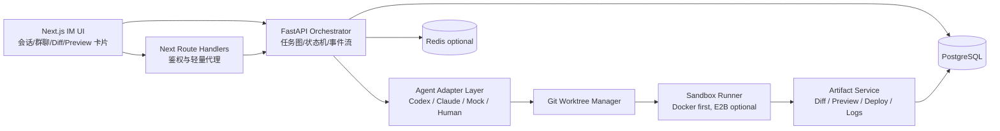

# AgentHub 落地型 Research Brief

截至 2026 年 5 月 13 日，主流 AI coding agent 产品已经明显从“IDE 里加一个聊天框”演进为一组更稳定的产品原语：项目级持久指令与规则文件、并行任务的工作区隔离、显式审批与沙箱控制、以及 diff／review／preview／deploy 这些可验证工件。Codex、Claude Code、Cursor、Windsurf、GitHub Agent HQ 都在往这个方向收敛；TRAE 官方也把重点放在 AI agent 驱动编码、调试、测试、部署的完整工作流，而不是单纯对话体验。基于这一趋势，AgentHub 最合理的定位不是“再做一个聊天机器人”，而是“把现成 coding agents 组织成 IM 原生协作界面”。这是一种基于公开产品走向的推断，不是命题方额外公开规则。 citeturn33search0turn33search5turn33search2turn33search3turn41search1turn22search2turn23search5turn24search6turn19search3turn38search3turn43search0

## 定位与使用场景

**项目一句话定位**

AgentHub 应该是一个**把 Claude Code、Codex 等 coding agent 封装成“可 @ 的会话成员”，并用 worktree + sandbox + artifact cards 驱动从需求到 diff／preview／deploy 闭环的 IM 式开发协作台**。

**目标用户与核心使用场景**

主要用户不是大企业平台管理员，而是 **三周内要交付 Demo 的课程参赛小队、学生主程、带队导师与 demo reviewer**。他们最需要的不是无限扩展的 agent 平台，而是：能在一个聊天界面里发起任务、观察执行、审阅代码、打开预览、做最少次数的确认，再把结果展示出来。

| 场景 | 用户目标 | 典型对话流程 | 涉及 Agent | 最终产物 |
|---|---|---|---|---|
| 需求到功能 | 把“新功能需求”在一次会话内落成可预览改动 | 用户粘贴 repo 背景与需求 → `@orchestrator` 拆任务 → `@frontend` / `@backend` 并行改代码 → `@qa` 验证 → 用户确认 diff → 生成 preview / deploy | Orchestrator、RepoScout、FrontendAgent、BackendAgent、QAAgent | 任务计划、代码 diff、测试结果、预览链接、可选部署链接 |
| 缺陷定位与修复 | 快速复现并修好 bug，而不是只给口头建议 | 用户发送报错日志或描述 → `@orchestrator` 判定是前端 / 后端 / 环境问题 → `@debugger` 复现 → `@coder` 修复 → `@qa` 做回归验证 | Orchestrator、DebuggerAgent、CoderAgent、QAAgent | root cause 摘要、修复 diff、回归测试结论 |
| 并行多人任务 | 在同一项目下同时推进多个需求，不互相污染工作区 | 用户新建多个会话：A 做登录、B 做管理页、C 做修 bug → 每个会话对应独立 worktree 和任务流 → 主界面统一看状态 | Orchestrator、多个角色 Agent，必要时 HumanAgent | 多会话状态面板、分支 / worktree 隔离结果、各自 diff |
| 原型验证与答辩展示 | 让非技术评委也能看懂 agent 做了什么 | 用户给出“做一个可演示页面 / 组件” → agent 生成改动 → 平台直接展示 preview 卡片与 diff 卡片 → 用户用自然语言追问“为什么这样改” | Orchestrator、FrontendAgent、ReviewAgent | 可点击预览、结构化 diff、解释性 summary |

从产品借鉴角度看，最有价值的高频场景其实与 Devin、Codex、Cursor、Windsurf、Replit、Lovable、v0 的公开工作流高度一致：需求进入后，系统不是只回答文本，而是进入“规划 → 改代码 → 运行验证 → 产生可审阅工件”的循环。 citeturn27search0turn22search15turn23search15turn25search5turn28search1turn29search4turn30search13

## 竞品与市场启发

一个非常重要的市场结论是：**Instruction 文件、worktree、审核面板、预览链接、受控命令执行**，正在成为 AI coding 产品的共用语言。Codex 读取 `AGENTS.md`；Cursor 公开了 Rules、AGENTS.md 与 Skills；Windsurf 公开了 AGENTS.md、Rules、Skills；Claude Code 公开了 subagents、skills、permission modes 与 worktrees。这意味着 AgentHub 最不应该做的事，就是自己再发明一套完全专有的规则系统。更合理的做法是：**用一个简洁的 AgentHub 规则层做 UI 映射，但底层尽量兼容现有 repo 约定。** citeturn33search0turn33search5turn33search2turn33search9turn33search10turn33search3turn41search1

**产品型方案**

| 产品/框架名称 | 类型 | 核心能力 | 可借鉴点 | 不适合直接照搬的点 | 对 AgentHub 的启发 |
|---|---|---|---|---|---|
| Claude Code citeturn41search3turn19search3turn20search1turn41search1 | AI coding agent / SDK | subagents、permission modes、hooks、MCP、worktrees、实验性 agent teams | “角色化子代理 + 工具权限 + 上下文隔离”非常适合映射成 AgentHub 的角色 agent | agent teams 仍有已知限制，且协调成本高；不适合学生项目直接复刻复杂自治团队 | 把 Claude 当执行引擎，而不是把其内建 team 机制当总编排器 |
| OpenAI Codex citeturn21search6turn21search13turn22search0turn22search2turn38search0turn38search15 | AI coding agent / CLI / IDE / cloud | CLI、IDE、cloud tasks、subagents、沙箱审批、GitHub code review、worktrees | 最值得借鉴的是“diff review、PR 工作流、worktree 并行、受控审批” | 产品面仍在快速变化，不适合把所有新特性硬编码进 MVP | AgentHub 可把 Codex 作为最强的“代码执行 / 审查型 adapter”之一 |
| Cursor citeturn23search1turn23search0turn23search3turn23search7turn23search18turn23search21turn23search23 | AI IDE | agent mode、cloud agents、subagents、plan mode、review、terminal sandbox、并行 agents window | “先计划再动手”与“并行 agent 面板”非常适合 AgentHub 的会话与任务设计 | Cursor 是 IDE-first，UI 以开发者编辑器为中心，不是 IM-first | AgentHub 可借鉴其多 agent 面板与 plan/review 双阶段流程 |
| Windsurf citeturn24search0turn25search5turn25search3turn25search2turn33search2 | AI IDE | Memories / Rules / AGENTS.md、Previews、增强终端、allow/deny list、多会话并行 | “预览内选中元素回传 agent” 对 AgentHub 的 preview 卡片很有价值 | 记忆 / 规则体系较重，三周内不值得全部自建 | AgentHub 应把 Preview 设计成一等工件，而不是外链 |
| GitHub Copilot / Agent HQ citeturn39search3turn39search0turn31search2turn31search13turn39search14 | 平台级 agent 入口 | 多 provider agent 统一入口、cloud agent、custom agents、issue→PR、sessions 追踪 | “多 agent 统一控制台”是 AgentHub 很好的产品参照 | 强依赖 GitHub 原生生态，不适合直接照搬到独立平台 | AgentHub 要做“会话 mission control”，而不是只做单对话 |
| Devin citeturn27search0turn27search5turn27search2turn27search4 | 端到端 AI 软件工程师 | Slack 触发、IDE / Browser / Shell 三件套、Review | “会话内可视 Dev Environment” 非常适合答辩与演示 | Devin 是高度一体化闭源产品，难以在三周内复制端到端深能力 | AgentHub 应优先把过程可视化，而不追求 Devin 全量能力 |
| OpenHands citeturn26search0turn26search2turn26search6turn26search10turn26search14 | 开源 agent 平台 | CLI / GUI / SDK、Docker sandbox、可替换 sandbox provider | “Docker sandbox + 本地 GUI/REST” 对自建实验平台很有参考价值 | 产品面较泛，容易把项目拖进“做平台”而不是“做 demo” | AgentHub 的 sandbox 层可借鉴其 Docker-first 思路 |
| Replit Agent citeturn28search0turn28search1turn28search2turn28search3turn28search9 | 云端端到端 AI 开发产品 | Agent、Preview、Development URL、Publish、Team workspaces、Automations | “预览即链接、发布即 URL” 非常适合课程 demo | 平台自带云环境，和自建 repo / 本地工作区模式不同 | AgentHub 可学习其“预览 / 发布极短路径” |
| Lovable citeturn29search2turn29search1turn29search4turn29search5turn29search0turn29search14 | AI app builder | 协作、预览链接、发布、GitHub sync、workspace | “预览链接 + 实时协作 + GitHub 同步” 很适合面向评审展示 | 过于偏 Web app 生成，不适合当通用多 agent 编排骨架 | AgentHub 可以参考其分享链路与协作者模型 |
| v0 citeturn30search0turn30search2turn30search3turn30search13turn30search20 | AI app builder / 平台 API | Platform API、项目管理、聊天历史、实时生成、live preview、Vercel 部署 | “聊天历史 + 实时生成 + live preview” 是 AgentHub artifact 流设计的优质参考 | 更偏 Web 产品生成，不适合直接做通用多 repo 执行框架 | AgentHub 的 demo 路线应更像“coding workspace”，而不是纯生成器 |

**编排框架型方案**

| 产品/框架名称 | 类型 | 核心能力 | 可借鉴点 | 不适合直接照搬的点 | 对 AgentHub 的启发 |
|---|---|---|---|---|---|
| LangGraph citeturn10search3turn10search7turn37search2 | 低层多 agent 编排框架 | 有状态、长运行、多 agent handoff、低层 runtime | supervisor / handoff / state graph 的思想非常适合做 AgentHub 的任务状态机 | 对三周项目来说太底层，容易把时间花在框架装配上 | 借鉴其状态图思想，自研轻量 task DAG 即可 |
| CrewAI citeturn9search2 | 多 agent 编排框架 | crews、flows、guardrails、memory、observability | 快速做多 agent 演示很方便 | 容易把产品做成“框架 demo”，不一定服务 IM UX | 可参考其“crew + flow”语义，但 MVP 不建议强绑定 |
| Semantic Kernel citeturn9search3 | agent orchestration SDK | 内建 concurrent / sequential 等模式 | 并行、串行、广播等模式描述非常清晰 | 生态重心更偏 Microsoft / SDK 侧，对 IM 产品 UI 帮助有限 | 用它来校准编排术语，而不是作为前置依赖 |
| AutoGen citeturn10search2turn10search1turn9search1 | 多 agent 框架 | event-driven、多 agent chat、docker code executor，但已进入 maintenance mode | 早期多 agent 聊天模式仍有参考价值 | 对 2026 新项目不宜作为主路线；官方已建议新用户关注 Microsoft Agent Framework | 最多把 AutoGen 当历史参考，不要把 MVP 建在它之上 |

**AgentHub 的核心差异化**

第一，**它不是普通聊天机器人**。普通聊天机器人以“回答”为主，而 AgentHub 的主对象是“会话 + 任务 + 工件”。用户最终看到的不是一段长回答，而是计划、diff、测试结果、preview、deploy 卡片。

第二，**它不是普通 AI IDE**。Cursor、Windsurf、Copilot、Claude Code、Codex 大多是 IDE-first 或 repo-first；AgentHub 应该是 **IM-first**，把多会话、群聊、@agent、任务状态、人工确认做成界面骨架，再把外部 agent 当执行器接入。Slack 线程、Feishu 话题回复、会话内标签页、Devin 的 Slack 线程触发都证明“聊天壳 + 工件卡片”是成立的协作形态。 citeturn11search3turn11search0turn35search1turn35search3turn27search5

第三，**它不是普通多 agent 框架**。LangGraph、CrewAI、Semantic Kernel 解决的是“如何编排”；AgentHub 要解决的是“如何让用户看懂、插手、确认并展示编排结果”。这意味着产品价值不在 DAG 本身，而在 IM 交互、审查节点、工件呈现与可答辩性。 citeturn10search3turn9search2turn9search3turn22search5turn25search5

第四，**它的真正卖点应该是 provider-neutral 的角色协作层**。用户可以 `@frontend`、`@backend`、`@qa`，而不一定先关心底层是 Codex 还是 Claude。底层 provider 只是 adapter 选择，顶层协作语义始终稳定。

第五，**它要把“信任层”做成显式产品能力**。Claude Code、Codex、Cursor、Windsurf 都把权限、审批、allow/deny、沙箱边界做成显式设置，这说明用户对 agent 的最大担忧不是“它会不会说”，而是“它会不会乱改、乱跑、乱发”。AgentHub 应该把这一层做成消息化审批与状态卡片。 citeturn19search3turn38search3turn23search18turn25search3

## MVP 范围与技术架构

**MVP 范围建议**

| 优先级 | 建议范围 | 说明 |
|---|---|---|
| P0 必须做 | 单用户工作区；会话列表；单聊；一个群聊会话；`@orchestrator` 与 `@role-agent`；一个真实 coding adapter；一个 MockAdapter；worktree 隔离；任务状态流；代码 diff 卡片；真实 preview；中断 / 重试；基础 deploy 卡片 | 这是“能演示、能答辩、能说明多 agent 价值”的最小闭环 |
| P1 加分项 | 第二个真实 adapter；HumanAgentAdapter；会话内 artifact 标签页；简化审批策略；导出 PR / patch；简单 cost 统计 | 这些功能会显著提高完成度，但不应阻塞 P0 |
| P2 可做成 mock / demo | 多用户协作、Slack / 飞书外部集成、自动巡检、background agents、复杂权限后台、provider marketplace | 适合作为演示故事，不适合三周内硬做实 |
| 明确不做 | 企业级 RBAC、组织计费、复杂多租户、全栈多语言部署矩阵、完整 MCP 市场、复杂自治 agent team、自定义推理可视化 | 这些会把项目拖成平台工程，而不是课程项目 |

最关键的控范围原则只有一句话：**P0 至少要有一个真实 adapter、一个真实 diff、一个真实 preview。** 如果没有这三样，AgentHub 很容易被评委理解为“换皮聊天”。反过来，只要这三样做实，即使第二个 adapter、部署、多人协作仍是 mock，也依然有说服力。这个判断与 Codex / Devin / Windsurf / Replit / Lovable / v0 的公开工作流非常一致：它们都把“代码变更可审、结果可看”放在文本解释之前。 citeturn22search5turn27search2turn25search5turn28search1turn29search5turn30search0

**推荐技术架构**



这套方案的核心不是“拆成很多服务”，而是 **让前端专注 IM 体验，让 Python 后端专注 agent 执行与长任务编排**。Next.js App Router 与 Route Handlers 适合做会话 UI、轻量 BFF 和卡片页面；Vercel AI SDK 的 `useChat` 直接支持流式对话 UI；FastAPI 则天然适合做类型化 API、长任务接口与后续的 WebSocket / SSE 扩展。Monaco 提供成熟的 diff editor；Git 原生支持 unified diff 与 worktree；Vercel 公开了 preview deployment 分享；OpenHands 与 E2B 都证明 Docker / sandbox 是 AI 代码执行的现实路径。 citeturn32search1turn16search0turn32search0turn16search1turn32search2turn36search0turn18search0turn18search1turn36search2turn15search1turn26search10turn15search2

**架构模块建议**

| 模块 | 推荐方案 | 三周理由 | 备注 |
|---|---|---|---|
| 前端技术栈 | TypeScript + Next.js App Router + Tailwind + shadcn/ui + Monaco Diff | 聊天式 UI、卡片化 artifact、diff viewer、路由与 BFF 一体化最省时间 | Next.js App Router 与 Route Handlers 适合这种产品壳；Monaco 原生支持 diff editor。 citeturn32search1turn16search0turn36search0 |
| 后端技术栈 | Python + FastAPI + Pydantic + SQLAlchemy/SQLModel + Alembic | Python 对 agent orchestration、CLI 封装、subprocess、异步任务更友好 | FastAPI 公开强调类型提示、高性能和 WebSocket 支持。 citeturn16search1turn32search2 |
| Agent Adapter 层 | 统一 `run / stream / interrupt / approve / collectArtifacts / cleanup` 抽象 | 先统一最小公共能力，不要企图标准化所有 vendor 细节 | Codex、Claude 都已有明显不同的审批 / 权限 / session 机制。 citeturn40search0turn40search2turn38search3turn38search15 |
| Orchestrator | 自研轻量任务状态机，不把 LangGraph/CrewAI 当 MVP 主依赖 | 三周内最该投的是 UI 与 artifact 流，而不是抽象框架 | 可参考 LangGraph handoff 与 Semantic Kernel concurrent/sequential 模式。 citeturn10search3turn37search2turn9search3 |
| 实时通信方案 | P0 用 REST + SSE；P1 再补 WebSocket | SSE 足够支撑 token 流、状态流、artifact ready 事件，工程复杂度最低 | 若未来要多人 presence，再补 WebSocket。AI SDK 的 chat UI 非常适合流式消息。 citeturn32search0turn32search2 |
| 代码执行与 sandbox | 每个 TaskRun 对应独立 Git worktree + Docker 容器；默认禁网或受限网络 | worktree 解决并行改动冲突，Docker 解决宿主污染 | Codex、Claude、Cursor、Windsurf 都在强化隔离与审批；OpenHands 明确推荐 Docker sandbox。 citeturn41search1turn22search2turn23search5turn25search2turn26search10turn38search3 |
| Diff 获取方案 | `git diff -p` 生成统一 diff；必要时 `git apply --check` 做补丁校验；前端用 Monaco Diff 展示 | 稳、标准、可答辩，且能做“接受 / 拒绝 / 复制 patch” | Git 默认 patch 文本与 apply 校验最适合课程项目。 citeturn18search0turn18search1turn36search0 |
| Preview 方案 | 容器内运行 dev server，反向代理到临时 URL；卡片里内嵌 iframe 与“打开新窗口” | 真正可操作、最能打动评委 | Windsurf、Replit、Lovable、v0 都把 preview 做成一等能力。 citeturn25search5turn28search1turn29search5turn30search0 |
| Deploy 方案 | P0 只支持一种“受控一键部署”路径：优先支持 Next.js demo 项目走 Vercel；其他栈显示 unsupported / mock | 控范围最重要；不要做部署平台矩阵 | Vercel Preview/Deploy、Lovable publish、Replit publish 都证明“一个平台打穿”比“全栈都支持”更实用。 citeturn15search1turn29search4turn28search9turn30search3 |
| 数据库与状态存储 | PostgreSQL 做 source of truth；Redis 只做可选事件总线 / 锁 | 保证刷新后状态不丢、消息可回放 | Redis Pub/Sub 是 at-most-once，不应当成唯一真相源。 citeturn32search3 |

**为什么优先推荐 TypeScript + Next.js + Python FastAPI，而不是纯 Java 或纯 Python**

如果目标是“三周内可开发、可演示、可答辩”，这个组合明显优于纯 Java 或纯 Python。原因不是语言之争，而是**前后端分工与生态成熟度**：Next.js 擅长做 Slack / 飞书式会话界面、卡片容器、分栏布局、实时流式消息与 Monaco diff；FastAPI 擅长把 agent、subprocess、任务状态、验证模型封装成清晰 API。纯 Python 当然能做后台，但要做出真正顺手的 IM 交互、可视 diff、preview 卡片与复杂前端状态管理，开发效率通常不如 React / Next 生态。纯 Java 则在三周学生项目里会面临更重的工程脚手架与相对更慢的 agent 试验迭代，尤其当你还要同时封装外部 CLI / SDK、做 prompt 与 adapter 快速试错时。换句话说，这个组选型本质上是 **“前端体验交给 TS，agent 执行交给 Python”**，而不是简单追求技术栈统一。 citeturn32search1turn16search0turn32search0turn16search1turn32search2

## Adapter 与编排设计

**Agent Adapter 抽象设计**

建议只定义 AgentHub 真正需要的**最小公共接口**，不要试图把所有 vendor feature 做成超大统一抽象。一个够用的接口可以是：

```ts
interface AgentAdapter {
  createRun(request: AgentRunRequest): Promise<AgentRunHandle>
  streamEvents(runId: string): AsyncIterable<AgentEvent>
  interrupt(runId: string): Promise<void>
  approve(runId: string, approval: ApprovalDecision): Promise<void>
  collectArtifacts(runId: string): Promise<ArtifactBundle>
  cleanup(runId: string): Promise<void>
}
```

这个接口背后的设计原则来自 Claude Code / Claude Agent SDK 的权限控制、subagents 与 hooks，以及 Codex 的 sandbox、approval policy、subagents、worktrees。它们都表明：**真正跨平台稳定的，不是模型名字，而是 run 生命周期、权限决策、产物收集与中断恢复。** citeturn40search0turn40search2turn41search4turn38search3turn38search15

**统一请求与统一事件**

推荐把输入收敛成六类核心字段：任务意图、repo / worktree 上下文、角色提示、权限配置、运行上限、依赖 artifact。把输出收敛成八类事件：`message.delta`、`task.state`、`approval.requested`、`artifact.diff.ready`、`artifact.preview.ready`、`artifact.deploy.ready`、`error`、`completed`。这样前端根本不需要知道某条消息来自 Claude 还是 Codex，只关心“这是哪个 agent、当前状态是什么、产生了什么工件”。

**各 adapter 的实现要点**

| Adapter | 输入 | 输出 | 生命周期 | 错误处理 | 权限边界 |
|---|---|---|---|---|---|
| CodexAdapter | prompt、role、worktreePath、sandbox policy、approval policy、model hint、allowed paths | token 流、状态事件、diff、review 结果、cloud task 链接（可选） | create → run → optional approve → collect diff / logs → cleanup | 统一映射 `PERMISSION_REQUIRED`、`SANDBOX_DENIED`、`PATCH_CONFLICT`、`TIMEOUT`、`UNSUPPORTED_CAPABILITY` | 映射 Codex 的 `sandbox_mode`、`approval_policy`、protected paths；不允许子 run 超过父权限。 citeturn38search3turn38search0turn38search4turn38search15 |
| ClaudeCodeAdapter | prompt、role、cwd/worktree、permission mode、allowed tools、custom subagents、MCP servers（可选） | token 流、subagent 结果摘要、工具调用日志、diff / logs | create → run → optional tool approval → collect artifacts → cleanup | 统一映射 `TOOL_DENIED`、`WAITING_FOR_USER`、`RUN_INTERRUPTED`、`TASK_STOPPED` | 映射 Claude 的 permission modes / rules / canUseTool；subagent 默认继承父边界，但允许更窄权限。 citeturn19search3turn20search2turn40search2turn41search4 |
| MockAdapter | 任务脚本、假延迟、预定义产物 | 稳定、可重复的事件流与工件 | create → timed emit → ready | 固定错误脚本，便于前端验证中断 / 重试 / 超时 UI | 无真实文件或网络权限，所有写入为模拟 |
| HumanAgentAdapter | 任务说明、上下文、期望交付物 | 手工回复、上传补丁、确认意见 | create → waiting_for_human → human_submit → completed | 超时后回退到 orchestrator 或重分配 | 只暴露需要人工查看的上下文，不给予宿主机执行权 |

**建议的权限模型**

建议 AgentHub 自己维护一层 provider-neutral 的权限结构，然后下发到 vendor adapter：

- `filesystem`: read-only / workspace-write / full-access
- `network`: off / allowlist / on
- `commands`: allow / ask / deny 前缀列表
- `protectedPaths`: 如 `.git/`、`.env*`、`secrets/`
- `approvalRequiredFor`: 写文件、运行命令、对外网络、git push、deploy
- `maxRuntimeSec` / `maxTurns` / `maxCost`

Codex 明确强调 protected paths、approval policy 和 sandbox boundaries；Claude 明确强调 permission modes、rules 与工具级控制；Cursor 和 Windsurf 都在终端层提供 allow/deny 或 sandbox 配置。这说明权限层不应被塞进 prompt，而应做成结构化配置。 citeturn38search0turn38search3turn19search3turn40search2turn23search18turn25search3

**Orchestrator 任务拆解设计**

不建议把 Orchestrator 做成一个“超强大总 agent”，而应做成一个**轻量调度器 + 结构化 planner**：

- 先解析用户意图：需求类型、风险级别、目标工件、是否需要人工确认。
- 再做 repo 扫描：语言、框架、现有 auth/data/model/test 约定、`AGENTS.md` / 规则文件。
- 再生成任务图：哪些步骤必须串行、哪些可并行、哪些节点必须停下来等人。
- 然后做 agent 选择：是 `FrontendAgent + CodexAdapter` 还是 `BackendAgent + ClaudeCodeAdapter`，由角色与 provider 分开决策。
- 最后做结果汇总：把多 agent 结果压平为对用户友好的消息、artifact 卡片和待确认动作。

这里最该借鉴的不是某个产品的 UI，而是 LangGraph 的 handoff / state graph 思想、Semantic Kernel 的 concurrent / sequential 模式，以及 OpenAI Agents SDK 的 handoff / guardrail 概念；但落地时应实现为一个有限状态机，不应把整个 MVP 建在通用框架上。另一个重要边界是：Claude 的 agent teams 仍有已知限制，AutoGen 已进入 maintenance mode，所以**MVP 里最好由 AgentHub 自己掌控总调度**。 citeturn37search2turn9search3turn37search4turn37search1turn41search5turn10search2

**一个可落地的 Orchestrator 流程**

| 阶段 | Orchestrator 动作 | 说明 |
|---|---|---|
| 意图解析 | 判定是“新功能 / bugfix / review / prototype / deploy”哪一类 | 决定是否需要计划卡、是否需要测试、是否必须人工确认 |
| 上下文整理 | 扫描 repo、读取规则文件、识别 stack、找相关文件 | 这一步可由只读 scout agent 执行 |
| 任务拆分 | 生成 3–6 个子任务，不超过 2 层嵌套 | 三周项目里要避免深层 agent 树 |
| Agent 选择 | 为每个子任务分配角色与 provider | 角色优先，provider 次之 |
| 调度依赖 | 能并行就并行；涉及同一文件或强依赖时串行 | 文件粒度冲突比 token 成本更真实 |
| 汇总与审查 | 聚合为摘要 + diff + preview + 验证日志 | 默认不展示原始深链式思维过程 |
| 人工确认 | deploy、危险命令、覆盖性改动必须人工确认 | 这是信任层核心 |
| 完成与归档 | 保存 artifacts、run logs、错误码、工作区引用 | 便于复盘、答辩与二次运行 |

**示例任务流**

下面给出一个“帮我给这个项目加登录功能”的现实任务流：

| 步骤 | 具体动作 | 执行关系 | 聊天界面呈现 |
|---|---|---|---|
| 读取需求 | `@orchestrator` 解析“加登录功能”，先识别项目是 Next.js、React SPA 还是别的栈 | 串行 | Orchestrator 发送“我先识别项目技术栈与现有用户系统” |
| 扫描代码库 | `@repo-scout` 只读搜索路由、数据层、现有用户表、环境变量、认证中间件 | 串行 | 一条折叠消息：“找到 6 个相关文件，建议沿用现有 session 方案” |
| 产出计划 | Orchestrator 生成 4 个子任务：数据层、接口层、页面交互、验证 | 串行 | 计划卡片：可展开、可人工改写 |
| 后后端实现 | `@backend` 修改 schema / API / middleware | 并行 | 状态气泡：“coding in auth-api branch…” |
| 前端实现 | `@frontend` 修改登录页、表单、守卫、导航 | 并行 | 状态气泡：“editing login-ui…” |
| 集成验证 | `@qa` 跑测试和本地运行，检查登录跳转/退出/错误态 | 串行，依赖后端与前端完成 | 测试卡片与日志摘要 |
| 产出工件 | 系统生成 diff 卡片、preview 卡片 | 串行 | 用户可直接点击看差异或打开预览 |
| 最终动作 | 用户点“确认合并”或“继续改”或“部署” | 人工确认 | 底部操作条：接受 / 继续 / 中断 / 重试 |

这里特别重要的一点是：**Orchestrator 展示的是“计划与证据”，不是冗长推理文本。** 评委和用户更愿意看“改了哪些文件、为什么改、有没有跑过、能不能打开”，而不是几百行 agent 自述。Codex、Devin、GitHub、Windsurf 的产品面都在强化这一点。 citeturn22search5turn22search3turn27search2turn39search6turn25search5

## 交互与数据设计

**IM 交互设计**

AgentHub 的 IM 体验应该直接借鉴成熟协作产品，而不是只学 AI 产品。Slack 证明线程能把讨论挂在某条消息下而不污染主聊天，Split view 证明“边聊边看文件 / 另一会话”是高价值交互；Feishu 的话题回复、会话内标签页、消息标记说明“消息流”和“工件流”可以并存；Discord 的 mention suggestions 说明 `@` 提及该尽量轻盈；Devin 证明 Slack thread 里触发 agent 也能成立；Windsurf / Replit / Lovable / v0 证明 preview 必须在产品壳内被看见，不应只存在于日志里。 citeturn11search3turn11search0turn35search1turn35search3turn35search2turn13search0turn27search5turn25search5turn28search1turn29search5turn30search0

因此，建议 AgentHub 的聊天交互遵循下面这套设计：

| 交互元素 | 设计建议 | 目的 |
|---|---|---|
| 单聊 | 用户可对 `@orchestrator` 或某个具名 agent 发 DM 式会话 | 降低学习成本，让首次使用像发消息一样自然 |
| 多会话并行 | 左侧会话列表；每个会话绑定独立 worktree / 分支 / 任务树 | 让“并行开发”真实可感，而不是口头承诺 |
| 群聊 | 一个会话内同时存在 User、Orchestrator、多个 Agent；默认按主消息线展示，细节可进 thread | 实现“一个任务里多人协作”的 IM 心智 |
| `@Agent` 指令 | `@orchestrator` 做拆解，`@frontend` / `@backend` / `@qa` 做角色路由；如有需要可用 `@codex` / `@claude` 做 provider override | 把“角色”与“底层 provider”解耦 |
| Orchestrator 消息 | 只发计划摘要、依赖关系、风险点、待确认动作 | 减少噪声，不暴露冗长内部推理 |
| Agent 执行状态 | 每条 agent 消息显示 `planning / coding / running tests / waiting approval / blocked / done` | 让用户知道 agent 不是“卡死了” |
| 代码 Diff 卡片 | 文件变更列表、增删行统计、展开查看、复制 patch、接受 / 继续修改 | 这是信任建立的核心界面 |
| Preview 卡片 | 缩略图 / URL / 打开预览 / 重新构建 / 回传页面元素或控制台错误 | 让演示闭环可见 |
| Deploy 卡片 | provider、目标环境、URL、状态、回滚入口（可选） | 让“一键部署”变成一个明确节点，而不是背景动作 |
| 用户确认 / 中断 / 重试 | 顶部或底部固定操作条；危险动作前弹确认；运行中可一键中断；失败可基于同一上下文重试 | 保障控制感 |
| Artifact 标签页 | 参考 Feishu，会话右上角可切“Diff / Preview / Deploy / Logs / Pins” | 让会话既是聊天流，也是工件容器 |

**建议的界面细节**

- 默认打开的是**消息流**，不是任务图。任务图是辅视图。
- 默认显示的是**摘要消息**，不是原始工具调用。工具日志收进折叠面板。
- 每个会话都应显示其绑定的 **branch / worktree / 最后一次运行状态**。
- Diff 卡片推荐支持 “**本轮改动** / **当前未提交改动** / **与主分支对比**” 三种视图，这和 Codex app / CLI review pane 的心智一致。 citeturn22search5turn22search11turn22search19
- Preview 卡片最好支持“**从页面回传问题给 agent**”，哪怕 P0 只做到“复制 URL + 手动描述问题”，也比完全割裂强很多。Windsurf 已经验证了“把页面元素 / 错误作为上下文发回 agent”的价值。 citeturn25search5

**数据模型建议**

下面这组实体足够支撑 OpenSpec 与后续开发，不需要一开始写完整 DDL。

| 实体 | 核心字段建议 | 说明 |
|---|---|---|
| User | `id`, `email`, `name`, `avatarUrl`, `role`, `createdAt`, `lastLoginAt` | 单用户模式也建议先留字段，避免后续返工 |
| Workspace | `id`, `name`, `ownerUserId`, `repoUrl`, `defaultBranch`, `rootPath`, `providerConfigsJson`, `createdAt` | 代表一个项目工作区 |
| Session | `id`, `workspaceId`, `title`, `sessionType`(`dm/group`), `boundBranch`, `worktreePath`, `status`, `lastMessageAt`, `pinnedArtifactIds[]` | 聊天会话是产品主对象 |
| Message | `id`, `sessionId`, `senderType`(`user/agent/system`), `senderId`, `parentMessageId`, `contentMd`, `messageKind`(`text/plan/status/artifact/approval`), `streamState`, `createdAt` | 既支持主消息，也支持 thread |
| Agent | `id`, `workspaceId?`, `name`, `role`, `adapterType`, `provider`, `defaultModel`, `systemPrompt`, `capabilitiesJson`, `permissionProfileJson`, `enabled` | 角色与 provider 分离 |
| Task | `id`, `sessionId`, `createdByMessageId`, `title`, `intentType`, `status`, `priority`, `planJson`, `dependsOnTaskIds[]`, `assignedAgentId`, `createdAt` | Orchestrator 拆出来的可调度单元 |
| TaskRun | `id`, `taskId`, `agentId`, `adapterRunId`, `state`, `startedAt`, `endedAt`, `worktreePath`, `sandboxId`, `errorCode`, `errorMessage`, `metricsJson` | 同一 Task 可能多次重试，因此需要 Run |
| Artifact | `id`, `taskRunId`, `artifactType`(`plan/diff/preview/deploy/log/report`), `title`, `storageUri`, `metaJson`, `createdAt` | 所有工件统一归档 |
| Diff | `id`, `artifactId`, `baseRef`, `headRef`, `patchText`, `changedFilesJson`, `statsJson` | 独立表或 JSON 都可以，独立表更清晰 |
| Preview | `id`, `artifactId`, `sandboxId`, `port`, `url`, `healthStatus`, `expiresAt`, `lastCheckedAt` | 支撑 preview 卡片 |
| Deployment | `id`, `artifactId`, `provider`, `environment`, `commitSha`, `url`, `status`, `deployLogUri`, `rollbackUri`, `createdAt` | 即便 P0 只支持一个 provider，也值得单独建模 |

一条非常实用的建模建议是：**Message 不直接存所有执行细节，执行细节归 TaskRun / Artifact。** 这样聊天流才不会变成日志数据库，前端也更容易做“消息视图”和“工件视图”的切换。

## 排期风险与交付策略

**三周开发排期**

| 周次 | 目标 | 主要任务 | 可验收成果 | 风险点 | Demo 检查点 |
|---|---|---|---|---|---|
| Week 1 | 打通最小聊天闭环 | Next.js 聊天壳；Session / Message / Task / Agent 数据模型；MockAdapter；一个真实 adapter 的最小跑通；worktree 管理；基础事件流 | 能创建会话、发消息、看到 agent 状态回流 | 外部 CLI / SDK 接口不稳定 | 现场演示：用户发一句话，系统能开始跑任务并回消息 |
| Week 2 | 打通代码工件闭环 | Orchestrator 规划；角色 agent 路由；真实 diff 生成；Monaco Diff 卡片；preview runner；中断 / 重试 | 能把一次任务变成可打开的 diff 与 preview | preview 环境与端口代理容易卡住 | 现场演示：需求 → 改代码 → 打开预览 |
| Week 3 | 打通可答辩闭环 | 群聊 / `@agent`；artifact 标签页；deploy 卡片；日志摘要；错误恢复；Demo 脚本；答辩材料 | 有一条完整演示路径和一条失败恢复路径 | deploy 超范围、临场不稳定 | 现场演示：用户追问、继续修改、再次预览、可选部署 |

**风险清单与规避策略**

很多风险其实已经被公开产品或文档正面承认：Claude 的 agent teams 仍有已知限制；OpenHands 的 process sandbox 没有隔离；Redis Pub/Sub 是 at-most-once；Codex 与 Claude 都强调沙箱与审批边界。这说明 AgentHub 最需要规避的，不是“模型回答不聪明”，而是**执行不可控、状态不可见、边界不清、范围失控**。 citeturn41search5turn26search14turn32search3turn38search3turn19search3

| 风险 | 表现 | 规避策略 |
|---|---|---|
| Agent 执行不可控 | 改错文件、越改越大、答非所问 | 强制 plan → code → review 三段式；所有大改动都先产出计划卡 |
| CLI 集成不稳定 | 外部命令超时、版本变化、异常退出 | 把 adapter 做成独立子进程封装；固定版本；所有异常统一归一化 |
| 多 Agent 协作只是噱头 | 多个 agent 同时说废话，没有实质收益 | 让 agent 分工围绕文件域或任务域，不围绕“人格” |
| worktree 冲突 | 多会话互相覆盖改动 | 每个 Session / TaskRun 固定一条 worktree；禁止共用工作目录 |
| sandbox 不安全 | 误删本地文件、读取 secrets | 默认 Docker；受限网络；保护路径；危险命令审批 |
| Preview 环境复杂 | 端口冲突、构建失败、iframe 打不开 | 只支持一个 demo 栈；固定启动脚本；预置健康检查 |
| 一键部署超范围 | 每种技术栈都想支持，结果都不稳 | P0 只支持一个 provider + 一个受控 demo 栈 |
| 长任务状态丢失 | 页面刷新后看不到进行中的任务 | Postgres 存真相源；前端重新连流时按 runId 回放 |
| 消息流噪声过大 | 工具调用刷屏，用户看不懂 | 默认显示摘要，日志折叠；Orchestrator 只发结构化进度 |
| diff 不可信 | patch 无法应用、展示与真实文件不一致 | 统一用 Git 生成 diff，必要时 `git apply --check` 先校验 |
| 测试时间过长或 flaky | agent 一直卡在跑测试 | 区分 smoke test 与 full test；MVP 默认跑轻量验证 |
| 3 周内做不完 | 越做越像平台 | Week 1 必须锁定 P0，后续只加分不翻盘 |

**真实现 vs Mock 建议**

| 必须真实现 | 可以 mock / demo |
|---|---|
| 会话列表与 IM 聊天壳 | 多人在线协作与 presence |
| 一个真实的 coding adapter | 第二个 / 第三个 provider adapter |
| Orchestrator 计划与任务状态 | 复杂自治 agent team |
| Git worktree 隔离 | 跨工具外部消息桥，如 Slack / 飞书 bot |
| 真实 diff 生成与 Monaco 展示 | 完整 PR 自动创建 / 评论回写 |
| 真实 preview URL / iframe | 全技术栈一键部署 |
| 中断 / 重试 / 基础审批 | 企业级权限后台、审计后台 |
| 基础 deploy 卡片或对单一 demo 栈的真实 deploy | 通用 deploy marketplace |

这里最值得强调的是：**如果部署做不稳，宁可 deploy 做 mock，也不要把 preview 做成 mock。** 因为 preview 是用户判断“它到底做出来没有”的最直接证据，而 deploy 更像加分项。

## OpenSpec 与 Codex 实施稿

**后续 OpenSpec 输入稿**

**change name**

`agenthub-im-multi-agent-coding-workspace`

**proposal summary**

构建一个 IM 聊天式多 agent 协作平台 AgentHub。平台以 Next.js 聊天前端为主壳，以 FastAPI orchestrator 为调度核心，通过统一 adapter 接入 Codex、Claude Code、Mock 与可选 Human agent。系统支持单聊、群聊、`@agent` 协作、多会话并行、独立 worktree、受控 sandbox、diff 卡片、preview 卡片与受限一键 deploy。目标不是做企业级平台，而是做一个三周内可跑通、可演示、可答辩的 MVP。

**problem statement**

现有 AI coding agent 多数要么是 IDE-first，要么是框架-first。前者在单人编程体验上很强，但不天然适合群聊、多会话、角色协作与统一过程展示；后者能编排 agent，却缺少面向最终用户的交互、审查与工件呈现。命题要求的 AgentHub 需要把“多 agent 协作”和“IM 式自然交互”结合起来，并且必须真实产生代码 diff、preview 与可演示闭环。

**goals**

- 用 IM 交互统一承载需求、执行、审查、确认与展示
- 通过统一 adapter 接入至少一个真实 coding agent
- 提供 worktree 隔离，支持多会话并行
- 提供真实 diff、真实 preview、可选真实 deploy
- 让 Orchestrator 能拆任务、分配角色 agent、汇总结果
- 支持中断、重试、审批、失败可见
- 能支撑一条完整的课程 demo 叙事

**non-goals**

- 不做企业级 RBAC / 计费 / 审计后台
- 不做完整 multi-tenant 平台
- 不做所有技术栈的一键部署
- 不做通用 MCP marketplace
- 不做高度自治的复杂 agent team 编排平台
- 不做多人实时共编编辑器

**capability list**

- Workspace / Session / Message 基础模型
- 单聊与群聊会话
- `@orchestrator`、`@frontend`、`@backend`、`@qa`
- CodexAdapter 或 ClaudeCodeAdapter 之一的真实接入
- MockAdapter
- Task / TaskRun / Artifact / Diff / Preview / Deployment 模型
- worktree 管理
- Docker sandbox runner
- diff 生成与 Monaco 卡片
- preview 构建与 URL 卡片
- deploy 卡片
- 中断 / 重试 / 审批机制
- artifact 标签页

**technical approach**

前端使用 TypeScript + Next.js App Router，负责 IM 界面、artifact 卡片与 Monaco diff；后端使用 FastAPI，负责 Orchestrator、Adapter、TaskRun 生命周期与状态流；Git worktree 负责多会话隔离；Docker 负责代码执行隔离；PostgreSQL 负责真相源；SSE 负责实时事件回流；部署仅支持单一 provider 与单一 demo 技术栈。

**milestone tasks**

- 搭建 Next.js 聊天壳与 FastAPI 框架
- 定义核心数据模型与 API
- 实现 MockAdapter
- 实现一个真实 adapter
- 实现 worktree manager
- 实现 Orchestrator MVP
- 实现 diff 服务与 Monaco 卡片
- 实现 preview 服务与卡片
- 实现 deploy 卡片
- 实现中断 / 重试 / 审批
- 准备 demo repo 与答辩脚本

**acceptance criteria**

- 用户能创建 workspace 与 session
- 用户能在会话中发送需求并看到 Orchestrator 产出计划
- 系统至少能真实驱动一个 coding agent 跑出代码改动
- 系统能展示真实 unified diff
- 系统能提供一个真实可打开的 preview
- 系统支持中断正在运行的任务并重试
- 多个 session 能并行存在，且改动不互相污染
- 至少有一条 demo 路线能完成“需求 → 改动 → 审查 → 预览 → 可选部署”

**给 Codex 的实现策略**

Codex 官方一直在强调两件事：第一，给足上下文与“done 定义”；第二，把 repo 规则写进 `AGENTS.md`，因为 Codex 会在开工前读取它。Codex 也已经把 review、GitHub PR review、cloud tasks、subagents、worktrees 做成显式工作流。因此，后续把 OpenSpec 的 `tasks.md` 交给 Codex 时，最好的策略不是“让它自由发挥”，而是 **把每个任务写成范围清晰、文件边界明确、带测试命令和验收标准的窄任务**。 citeturn22search15turn33search8turn22search11turn22search0turn21search15

另一个非常强的建议是：在 AgentHub 仓库根目录放一份真正有内容的 `AGENTS.md`，至少包括 repo 结构、启动命令、测试命令、数据库迁移方式、禁止项、完成定义。这样不仅 Codex 会读，Cursor 与 Windsurf 也支持同类规则文件，后续项目可迁移性更高。 citeturn33search0turn33search5turn33search2

下面这些 prompt 模板可以直接给 Codex 使用：

**任务模板一**

> 你现在是 AgentHub 项目的前端实现者。  
> 目标：在 Next.js 项目中实现 IM 会话列表、消息流与输入框，不要实现真实 agent 逻辑。  
> 范围仅限：`apps/web` 或前端目录；不得修改后端目录。  
> 输出要求：  
> - 提供 session list、message list、composer 三个核心区域  
> - 预留 message kind：text / status / artifact  
> - 用 mock data 驱动  
> - 保持组件拆分清晰，便于后续接入 SSE  
> 验收标准：  
> - 本地可启动  
> - 会话切换正常  
> - 支持 status message 与 artifact card 占位  
> 在完成后：  
> - 运行前端 lint / typecheck  
> - 给出修改文件列表与后续接入点说明  
> 不要扩展范围到鉴权、多人协作、部署。

**任务模板二**

> 你现在是 AgentHub 项目的后端实现者。  
> 目标：实现 FastAPI 中的 Session、Message、Task、TaskRun 基础模型与 CRUD API。  
> 范围仅限：后端目录与数据库迁移文件。  
> 输出要求：  
> - 定义最小可用 schema  
> - 为前端提供列表、详情、创建接口  
> - 预留 stream 事件模型字段  
> 验收标准：  
> - API 可跑通  
> - 数据库迁移可执行  
> - 返回结构稳定、便于前端消费  
> 在完成后运行：后端单元测试与 basic smoke test。  
> 不要实现 adapter、不做 preview、不做 deploy。

**任务模板三**

> 你现在负责 AgentHub 的 Adapter 基础层。  
> 目标：设计并实现统一 adapter interface，以及 MockAdapter。  
> 要求：  
> - 输出统一生命周期：createRun / streamEvents / interrupt / approve / collectArtifacts / cleanup  
> - 定义统一事件结构  
> - MockAdapter 要能稳定模拟 planning、coding、waiting approval、completed、error 五种状态  
> 验收标准：  
> - 前端可以用 MockAdapter 完整演示一次任务运行  
> - 代码中不出现 vendor-specific hardcode 泄漏到上层 UI  
> 不要实现真实 Codex / Claude 接入。

**任务模板四**

> 你现在负责 AgentHub 的 Worktree 与 Diff 基础设施。  
> 目标：实现每个 TaskRun 独立 worktree 的创建、清理，以及 unified diff 生成。  
> 要求：  
> - 使用 git worktree  
> - 生成 patch 文本  
> - 提供 changed files 与 stats  
> - 对 patch 做基础校验  
> 验收标准：  
> - 两个 session 并行创建 worktree 时互不冲突  
> - 可以为指定 run 返回真实 diff  
> 不要实现 preview 与 deploy。

**任务模板五**

> 你现在负责 AgentHub 的 CodexAdapter。  
> 目标：把 Codex 作为一个真实 adapter 接入系统。  
> 要求：  
> - 支持 run、stream、interrupt  
> - 支持基础审批与错误映射  
> - 支持把结果转成统一事件流  
> - 支持在 worktree 中运行  
> 验收标准：  
> - 用户能从聊天界面发起一次真实任务  
> - 能看到状态变化  
> - 能拿到真实 diff  
> - 错误时能返回统一 error code  
> 范围控制：只实现当前项目需要的最小能力，不做 cloud tasks UI，不做全量 feature parity。

**任务模板六**

> 你现在负责 AgentHub 的 Preview 服务。  
> 目标：实现一个最小可用 preview runner，把受支持 demo 项目启动到临时 URL，并在前端展示 Preview 卡片。  
> 要求：  
> - 只支持一个 demo 栈  
> - 卡片中显示 preview 状态、URL、刷新操作  
> - 后端记录 health status  
> 验收标准：  
> - 完整运行后能从聊天流打开 preview  
> - 页面刷新后 preview 状态仍可恢复  
> 不要扩展到全部框架，也不要一开始做复杂权限系统。

**任务模板七**

> 你现在负责 AgentHub 的 Orchestrator MVP。  
> 目标：把用户需求拆成 3 到 5 个子任务，并分配给角色 agent。  
> 要求：  
> - 支持至少四种角色：orchestrator、frontend、backend、qa  
> - 支持串行 / 并行依赖  
> - 支持汇总结果为用户可读消息  
> - 支持中断与重试  
> 验收标准：  
> - 对“给项目加登录功能”能给出结构化计划  
> - 执行后可以产出可见状态与 artifact 引用  
> 不要实现复杂 LLM 递归自治，不要无限生成子任务。

**任务模板八**

> 你现在负责 AgentHub 的演示与收尾。  
> 目标：补齐 demo 脚本、错误处理、日志摘要、README 与答辩辅助材料。  
> 要求：  
> - 提供一条成功案例和一条失败恢复案例  
> - README 说明如何本地启动、如何触发 demo  
> - 给出演示顺序建议  
> 验收标准：  
> - 新同学按文档可跑起 demo  
> - 评委能在 5 分钟内理解产品价值  
> 不要在这一轮新增平台级能力。

**OpenSpec 落地摘要**

- **change name**: `agenthub-im-multi-agent-coding-workspace`
- **proposal summary**: 构建一个 IM 聊天式多 agent 协作台，把 coding agents 封装成可 @ 的会话成员，并串起 diff / preview / deploy 工件流
- **goals**: 一个真实 adapter、真实 diff、真实 preview、多会话并行、Orchestrator 计划与汇总、可中断可重试
- **non-goals**: 企业后台、多租户、全栈部署矩阵、复杂自治团队、完整外部 IM 集成
- **capability list**: Session、Message、Agent、Task、TaskRun、Artifact、Diff、Preview、Deployment、worktree、sandbox、approval
- **milestone tasks**: 聊天壳 → 数据模型 → MockAdapter → 真实 adapter → worktree/diff → preview → orchestrator → deploy 卡片 → demo 收尾
- **acceptance criteria**: 能从一条需求走到可见计划、真实代码改动、可查看 diff、可打开 preview，并支持中断 / 重试 / 多会话隔离